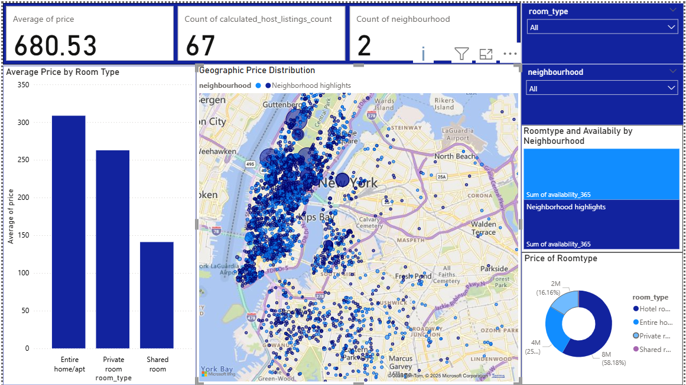
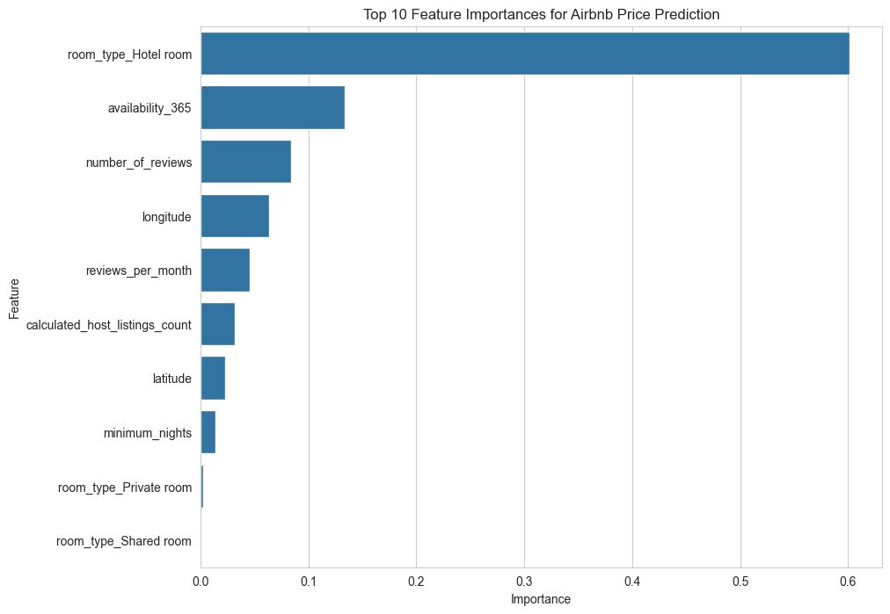

# Airbnb Dynamic Pricing Engine for NYC

### Project Overview
This project is an end-to-end data analysis of the New York City Airbnb market. The goal was to identify key pricing drivers, build a predictive machine learning model, and visualize the findings in a professional, multi-page interactive dashboard to provide actionable insights for hosts.

---

### Key Features
* **Exploratory Data Analysis (EDA):** Investigated relationships between price, location, room type, and reviews.
* **Predictive Modeling:** Trained a `RandomForestRegressor` model to predict listing prices, achieving an **R-squared of 0.29** and an **RMSE of $364.12**.
* **Advanced Dashboarding:** Built a comprehensive Power BI dashboard with advanced, user-friendly features:
    * **KPI Overview:** High-level metrics for a quick market summary.
    * **Drillthrough Functionality:** Users can right-click any neighborhood on the map to drill down to a detailed, neighborhood-specific report page.
    * **Custom Tooltips:** Hovering over the map reveals a custom-designed pop-up with additional insights, such as average reviews.

---

### Tools Used
* **Programming:** Python (Pandas, Scikit-learn, Matplotlib, Seaborn)
* **Environment:** Jupyter Notebook
* **Visualization:** Power BI

---

### Enhanced Power BI Dashboard
Here is a preview of the interactive Power BI dashboard. It includes a market overview, KPI cards, and advanced features like drillthrough and custom tooltips.

---

### Model Feature Importance
The chart below shows the top 10 features that our model found most influential in predicting price, with location (`longitude`, `latitude`) being the most critical factors.

